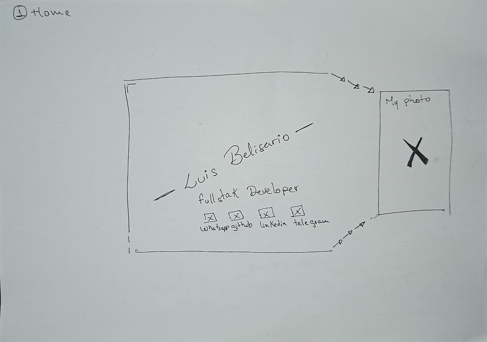
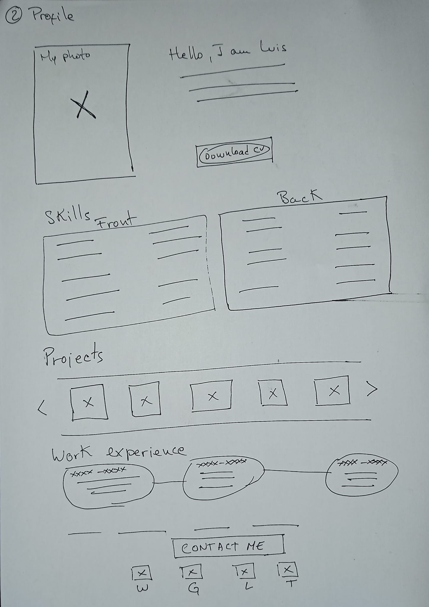
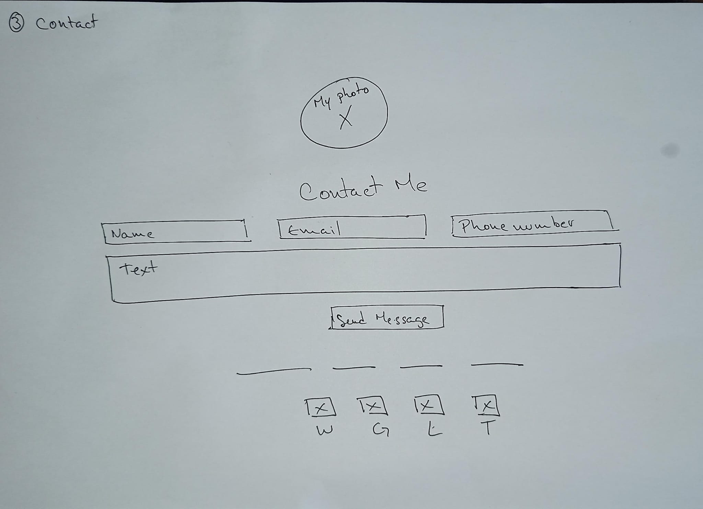

<h1 align="center"> My Angular Portfolio </h1>

<h2 align="center">Hi 👋, I'm Luis Belisario Fullstack Developer</h2>

Greetings everyone, I am creating my own portfolio based on Angular, I will do it as time allows, since I am currently in a demanding project. I will tell you here about the progress and the general idea I have for it, I hope you like it and can leave your recommendations and suggestions. Furthermore, I hope it will be of benefit to the entire community.

----

### Task list:

- [x] Find 3 examples of portfolios that I like and generate an idea of ​​my ideal portfolio.
    - [x] Portfolio 1.
    - [x] Portfolio 2.
    - [x] Portfolio 3.
    - [x] Generate an idea of ​​my ideal portfolio.
- [x] Made a sketch of this project.
    - [x] Home.
    - [x] Profile.
    - [x] Contact.
- [ ] Build the skeleton.
    - [ ] Home.
    - [ ] Profile.
    - [ ] Contact.
- [ ] Add routes and links.
    - [ ] Internal.
    - [ ] External.
- [ ] Add styles and images:
    - [ ] Photos of me for the home, profile and contact.
    - [ ] Text Styles.
    - [ ] Color palette.
    - [ ] Background Colors.
    - [ ] Images of Skills.
    - [ ] Project presentation images.
- [ ] Connect to database:
    - [ ] Connect to firebase.
    - [ ] Set alerts.

----
### Task list applied:

1. #### Find 3 examples of portfolios that I like and generate an idea of ​​my ideal portfolio:
    - [Portfolio 1.](https://www.templatemonster.com/es/paginas-de-aterrizaje-tipo-94400.html?utm_source=google&utm_medium=cpc&aff=tm&gclid=cj0kcqjwsp6pbhcfarisad3gzubprrdicg9k0jda8hdefvoxvfxyrzc6c7wruswa85syoyhiz2ybolsaarpnealw_wcb)
    - [Portfolio 2.](https://brixtemplates.com/templates/developer-portfolio-webflow-template)
    - [Portfolio 3.](https://technext.github.io/JohnDoe/)
    - Generate an idea of ​​my ideal portfolio:
        - My ideal portfolio is made up of three views, a captivating home page that leaves a good first impression that is clean, sober and sophisticated, then a profile view made up of my job description as well as my skills and projects; finally a specific screen to contact me.
2. #### Made a sketch of this project:
    - Home:
    
    - Profile:
    
    - Contact:
    
3. #### Build the skeleton:
    - Home: Starts with my name as the main text, followed by the text with my title, at the bottom links to my contact pages.
    - Profile: In the style of a CV, it starts with my photo with presentation data and link to PDF of the CV; Following this, two components, one for the front and another for the back where the Skills are detailed; Third would be the projects that I have worked on in the form of a carousel, I imagine image and description; finally the work experience in the form of periods of time and we close with social networks.
    - Contact: Something minimalist, with simple contact information.
4. #### Add routes and links:
    - Internal navigation:
        - Home: To profile.
        - Profile: To home and contacts.
        - Contact: To home and profile.
    - External navigation:
        - Component that is reusable for all three screens.
            - WhatsApp.
            - Telegram.
            - Linkedin
            - Github.
        - Links to the different projects.
            - Celta.
            - COMA.
            - Fabihogar.
            - Venecake.
            - Dalujo.
5. #### Add styles and images:
    - Home: The home will have a half-length image of me in the background, my name inclined, large and in a striking style, the predominant color is black, image in black and white.
    - Profile: Background of two dark black tones that make a contrast, like those of the VSC, profile image in color, as the second predominant color to highlight links or other blue elements, white text.
    - Contact: Maintain the Profile style.
6. #### Connect to the database:
    - At this point, since the project is small, I am going to use Firebase.

----    

<h3 align="center">If you want to know more about me, I leave you a little of my info:</h3>

<h3 align="left">Connect with me:</h3>

<h3 align="left">Languages and Tools:</h3>

Programming Languages:

 

Frontend Development:

     

Backend Development:

   

Database:

       

Devops:

Backend as a Service(BaaS)

 

Testing:

 

Software:

            

Static Site Generators:

Other:

